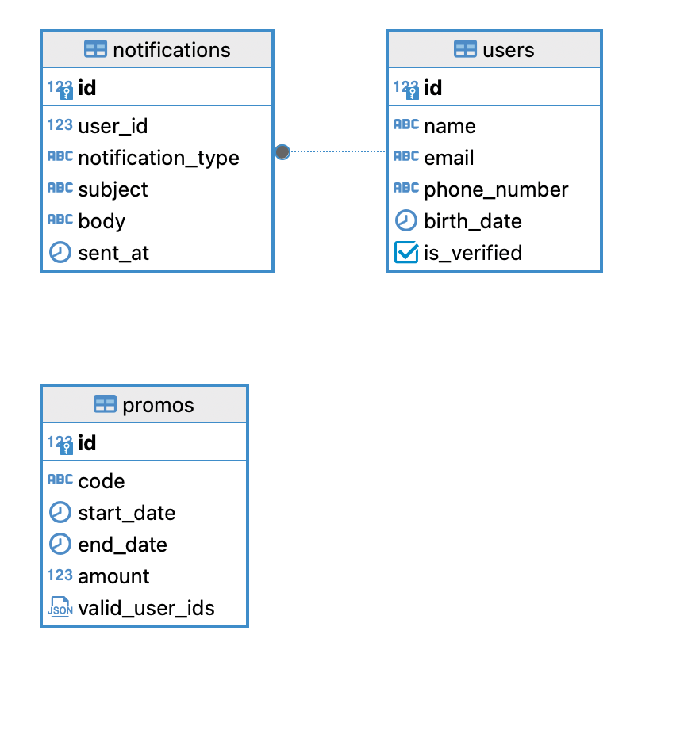
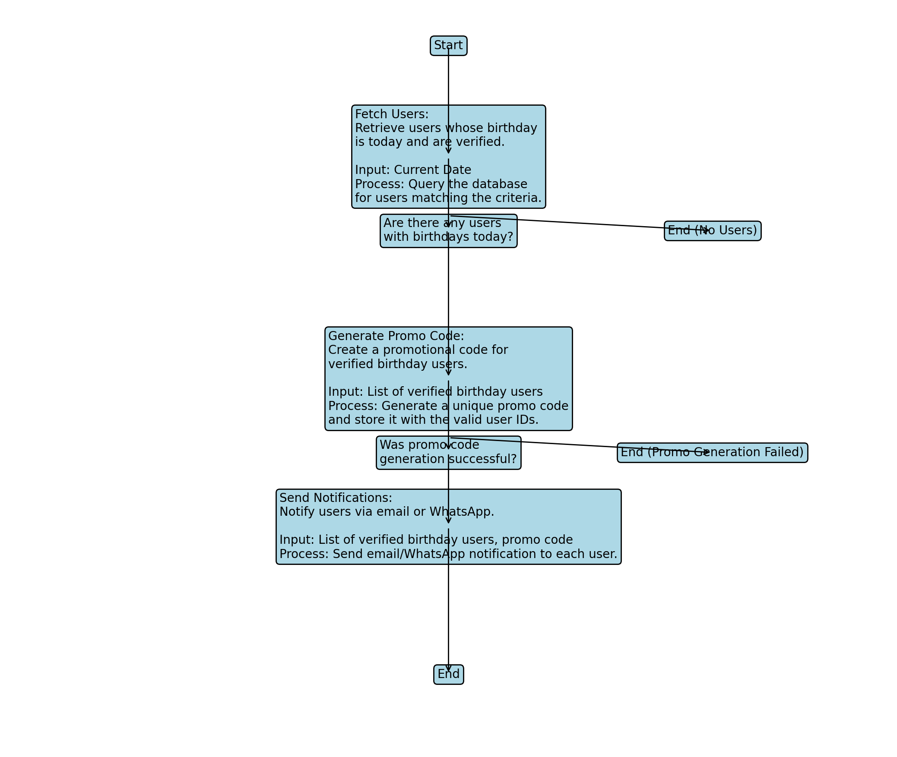

# SendGiftCode

SendGiftCode is a TypeScript-based Express.js application for sending promotional codes to users, especially on their birthdays.

## Prerequisites

Before running the application, ensure you have the following installed:

- [Node.js](https://nodejs.org) (v14 or later)
- [PostgreSQL](https://www.postgresql.org) (v12 or later)

## Entity-Relationship Diagram (ERD)



---

## Flowchart



## Installation

1. Clone the repository:

   ```bash
   git clone <repository-url>
   ```

2. Install dependencies:

   ```bash
   npm install
   ```

3. Set up environment variables by creating a `.env` file in the root directory:

   ```env
   DB_USER=username
   DB_HOST=localhost
   DB_NAME=sayakaya
   DB_PASSWORD=password
   DB_PORT=5432
   ```

## Database Setup

1. Create the required tables by running the SQL scripts located in the `sql` directory.

2. If needed, generate dummy data by running the seeder script:

   ```bash
   npm run seed
   ```

## Usage

Start the server:

```bash
npm start
```

The server will be running at `http://localhost:3000` by default.

## API Endpoints

- **POST /sendPromo**: Endpoint to send promotional codes.

## Cron Job

A cron job is set up to automatically send birthday promos every day at midnight. To ensure the cron job runs correctly, make sure your server is running continuously.
